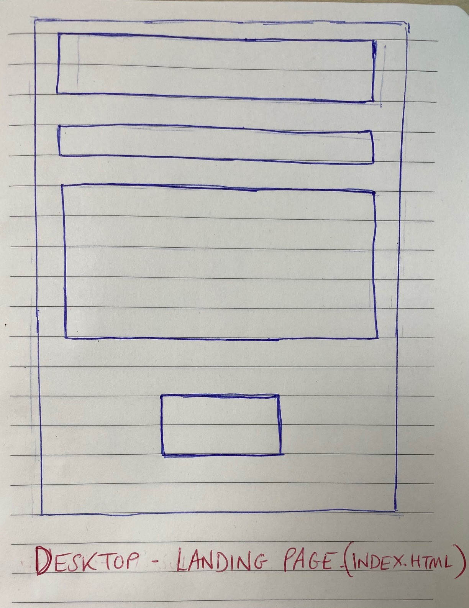

# Vexillological Vexation!

'Vexillological Vexation!' is a web based flag guessing game. Players are presented with a question along with images of two different flags however only one of the flag images correctly matches the country in the question. The player must then click on the flag they believe to be correct. If they have selected the correct flag, the correct score tally will increase by one. If they have selected the incorrect flag, the incorrect score tally will increase by one. The game ends after 20 questions and players are shown how many questions out of 20 they got correct in a numerical and percentage format. The game is aimed all ages.


## User Stories

- As a user, I want to be able to read about how to play the game before playing.
- As a user, I want to be able to initiate the start of the game myself.
- As a user, I want to be able to intuitively know where to click to make my flag selection.
- As a user, I want to be able to see my performance within the game e.g. how many questions have I got correct/incorrect so far.
- As a user, I want to be able to avoid repetition of flags I have already guessed correctly.
- As a user, I want to be able to view the site on any device, so that I can see it on my phone, tablet, or desktop.

## UX

The aim of my site design was to be as simple, clear and concise as possible.

The landing page contains the title of the game, instructions of how to play and a large 'Start' button to draw the player's attention to the element which will allow them to begin the game.

The page where the game is played is streamlined to the title of the game, a box to tally correct answers, a box to tally incorrect answers, a box detailing the question number, a box detailing the question, and two clickable buttons displaying the flag option images.

Finally, when the 20th question has been answered, the page updates to display the results summary page which contains a box congratulating the user for finishig the game, a summary of their numerical score out of 20 which is also expressed as a percentage along with two clickable buttons namely 'Play Again' and 'No thanks...'. Clicking 'Play Again' will take the user to a new game page and a new 'Question 1' where as clicking 'No thanks...' will take the user back to the landing page.

The website is designed to react responsively when the screen size decreases to medium and below.

When the screen size decreases beyond the medium breakpoint, any columns which are usually adjacent to each other on a large screen will stack on top of each other.

### Colour Scheme

The body has a background colour of _Dark Liver_ to allow the content boxes to stand out. The content boxes have a background colour of _Burgundy_ with a border and text colour of _Middle Yellow_.
This colour scheme is inspired by the colour scheme of the video game Crash Bandicoot!

.

The colour scheme below was generated using [coolors](https://coolors.co/).


### Typography

The font selected for the website was _Rakkas_ which was imported from [Google Fonts](https://fonts.google.com/specimen/Rakkas).

This font was also selected as it reminded me of the font used in the famously frustrating game 'Crash Bandicoot'. I could imagine players of my game becoming frustrated at selecting the incorrect flag and decided that this font was therefore a good choice.

### Wireframes

__Large Screen Landing Page Wireframe__


__Large Screen Game Page Wireframe__


__Large Screen Results Summary Wireframe__


__Medium Screen and Below All Pages Wireframe__


## Features 

### Existing Features

### Favicon

This image features on the browser tab for all pages. The favicon is a mini version of the waving flags gif utilised on buttons within the game.


### Landing Page


#### Landing Page: Game Title and Explanation

The home/landing page contains a the title of the game, a box with a heading of 'How to Play' and a box below with specific game instructions.

#### Landing Page: Start Button

The final element on the landing page is a large start button which contains an animation of multiple flags fluttering on repeat. This is to draw the user's attention to the start button to make it clear that this is how the game can be initiated. The clickable start button launches the game by directing the user to the game page (vex-vex.html). This is achieved using code below:
```javascript
<// Lets the user initiate a game via a click on the 'start' button.
document.getElementById("landing-page-start").addEventListener('click', function () {
    location.href = 'vex-vex.html';
});>
```

### Game Page


#### Title Hyperlink

The top of the game page maintains visibility of the game's title. The title also serves as a hyperlink to return to the landing page.

#### Correct/Incorrect Score Tallies

Boxes displaying tallies for correct and incorrect answers are located below the title. These increment by 1 respectively depending on whether the user has guessed the flag correctly/incorrectly.

#### Question Number and Question Boxes

Beneath the score tally boxes are boxes displaying the question number and the name of the country whose flag must be identified. The question number increments by 1 after every guess where as the name of the country will be the name of one of the flags displayed.

#### Clickable Flag Image Options

Finally, two clickable buttons are located below the box containing the country name, and it is these buttons which display the flag image options for the user to choose between.

#### Randomised Flag Selection

The flags displayed for each question are selected randomly from a database of 50 flags. In addition to this, the code is written to ensure that the same flag cannot be displayed for both options. The code below illustrates how this is achieved:

```javascript
// Function to randomly generate values for game.option1 and 
// game.option2 from the game.database.flags array.
function optionGen() {
    game.questionnum++;
    document.getElementById("question-num").innerHTML = `Question Number: ` + (game.questionnum);
    game.option1 = (game.database.flags[Math.floor(Math.random() * game.database.flags.length)]);

    //Filters game.option1 value out of game.database.flags array
    //and selects game.option2 value from filtered array. This
    //ensures that game.option1 != game.option2.
    //Credit: https://www.w3schools.com/jsref/jsref_filter.asp
    //Credit: https://stackoverflow.com/questions/5767325/how-can-i-remove-a-specific-item-from-an-array
    let value = game.option1;
    let arr = game.database.flags;
    let databaseFilt = arr.filter(function (item) {
        return item !== value;
    });
    //Generates game.option2 value from the filtered dabase which does
    //not contain the generated game.option1 value.
    game.option2 = (databaseFilt[Math.floor(Math.random() * databaseFilt.length)]);
    //Generates question value which is either game.option1 or game.option2.
    game.question = [game.option1, game.option2][Math.round(Math.random())];
}
```

#### Local Storage Web API

In order to display user's results in the 'Results Summary' page, the ability to preserve the value of the user's 'correct' score tally was required. In order to do this, local storage was used as part of the endGame function. The code for this is shown below:

```javascript
// Ends the game and directs user to finished.html if the sum of game.correctscore and game.incorrectscore is equal to 20.
// Changes html text of elements with ids "question-num" and "question" to 'Game Over!' and 'Thanks for Playing!' respectively.
// Stores the number of correct answers as "result"to be called upon on a different page.
function endGame() {
    if (game.correctscore + game.incorrectscore == 20) {
        document.getElementById("question-num").innerHTML = `Game Over!`
        document.getElementById("question").innerHTML = `Thanks For Playing!`
        // Code Credit: https://stackoverflow.com/questions/47817325/storing-my-game-score-in-local-storage Antoni
        localStorage.setItem("result", document.getElementById("correct").innerHTML);
        location.href = 'finished.html';
    }
}
```

### Results Summary Page


#### Congratulations and Result Summary
Once the user has answered their 20th question, the results summary page will be displayed. This page congratulates the user on finishing the game and summarises the user's score numerically e.g. 12/20 and in a percentage format e.g. 60%.

#### 'Play Again' and 'No thanks...' Buttons
This page contains two clickable buttons, namely, 'Play Again' and 'No thanks...'. These buttons have the sane format as the 'Start' button located on the landing page to maintain consistency. If the 'Play Again' button is clicked, the user will be directed to a new round of questions. If the 'No thanks...' button is clicked, the user will be directed back to the landing page where they can start a new game whenever they are ready.

### Features Left to Implement

Future features to implement would be as follows:
- Increase the number of flags in the database e.g. increase to 100.
- Remove the set number of questions and include a timer to get all of the flags correct.
- Add a feature for users to save their high score for future comparison.
- Add a continent selector option at the beginning so that users are only presented with flags from Europe for example.

## Technologies Used

- [Git](https://www.atlassian.com/git) - used for version control.
- [GitHub](https://github.com/) - used to secure my code online.
- [Gitpod](https://www.gitpod.io/) - used as the cloud-based IDE. 
- [GitHub Pages](https://github.com/sniclasj/vexillological-vexation/deployments/activity_log?environment=github-pages) - used to deploy the site.
- [amiresponsive](http://ami.responsivedesign.is/#) - used for the mockup image.
- [HTML](https://en.wikipedia.org/wiki/HTML) - used to write the code for the website.
- [JavaScript](https://en.wikipedia.org/wiki/JavaScript) - used to write the code for the website.
- [Jest](https://jestjs.io/) - used to test the functionality of JavaScript code.
- [CSS](https://en.wikipedia.org/wiki/CSS) - used to style the website.
- [Bootstrap](https://getbootstrap.com/docs/4.4/getting-started/download/#bootstrapcdn) - used to create a grid structure for the website.
- [Local Storage](https://developer.mozilla.org/en-US/docs/Web/API/Window/localStorage) - used to store the user's correct score value from vex-vex.js so that it could be recalled in finished.js.

## Testing

To view all testing documentation, please refer to [TESTING.md](TESTING.md)

## Deployment

The site was deployed to GitHub pages. The steps to deploy are as follows:
  - In the GitHub repository, navigate to the Settings tab 
  - From the source section drop-down menu, select the Main Branch
  - Once the main branch has been selected, the page will be automatically refreshed with a detailed ribbon display to indicate the successful deployment. 

The live link can be found here - [Vexillological Vexation!](https://sniclasj.github.io/vexillological-vexation/)

### Local Deployment

In order to make a local copy of this project, you can clone it. In your IDE Terminal, type the following command to clone my repository:

- `git clone https://github.com/sniclasj/vexillological-vexation.git`

Alternatively, if using Gitpod, you can click below to create your own workspace using this repository.

[](https://gitpod.io/#https://github.com/sniclasj/sj-vexillological-vexation)

## Credits 

### Content 

_Landing Page HTML (index.html)_

- [Stack Overflow (Balus C): HTML Button Linking To New Page](https://stackoverflow.com/questions/2906582/how-to-create-an-html-button-that-acts-like-a-link)

_Game Page JS (vex-vex.js)_

- [W3 Schools: Filtering JS Array](https://www.w3schools.com/jsref/jsref_filter.asp)
- [Stack Overflow: Removing Specific Item From JS Array](https://stackoverflow.com/questions/5767325/how-can-i-remove-a-specific-item-from-an-array)
- [W3 Schools: Changing Element IDs](https://www.w3schools.com/jsref/prop_html_id.asp)
- [W3 Schools: Changing Element InnerHTML](https://www.w3schools.com/jsref/tryit.asp?filename=tryjsref_node_textcontent_innerhtml_innertext)
- [Stack Overflow: Pushing ID Of Clicked Element To Array (shamittomar)](https://stackoverflow.com/questions/4825295/onclick-to-get-the-id-of-the-clicked-button)
- [Stack Overflow: Storing Game Value For Use On Another Page (Antoni)](https://stackoverflow.com/questions/47817325/storing-my-game-score-in-local-storage)
- [Love2Dev: Using Splice to Remove Array Elements](https://love2dev.com/blog/javascript-remove-from-array/#remove-from-array-splice)

_Game Page Testing (vex-vex.test.js)_

- [Stack Overflow: Jest Matcher To One Of Two Values (jordrake)](https://stackoverflow.com/questions/51519041/jest-matcher-to-match-any-one-of-three-values)

### Media

_Flag Images_
- [All Waving](https://www.allwavingflags.com/)
- [Argentina](https://en.wikipedia.org/wiki/Flag_of_Argentina)
- [Austria](https://en.wikipedia.org/wiki/Flag_of_Austria)
- [Belgium](https://en.wikipedia.org/wiki/Flag_of_Belgium)
- [Bolivia](https://en.wikipedia.org/wiki/Flag_of_Bolivia)
- [Brazil](https://en.wikipedia.org/wiki/Flag_of_Brazil)
- [Canada](https://en.wikipedia.org/wiki/Flag_of_Canada)
- [Cape Verde](https://en.wikipedia.org/wiki/Flag_of_Cape_Verde)
- [Chile](https://en.wikipedia.org/wiki/Flag_of_Chile)
- [Croatia](https://en.wikipedia.org/wiki/Flag_of_Croatia)
- [Czech Republic](https://en.wikipedia.org/wiki/Flag_of_the_Czech_Republic)
- [Denmark](https://en.wikipedia.org/wiki/Flag_of_Denmark)
- [East Timor](https://en.wikipedia.org/wiki/Flag_of_East_Timor)
- [Ecuador](https://en.wikipedia.org/wiki/Flag_of_Ecuador)
- [Egypt](https://en.wikipedia.org/wiki/Flag_of_Egypt)
- [Estonia](https://en.wikipedia.org/wiki/Flag_of_Estonia)
- [Ethiopia](https://en.wikipedia.org/wiki/Flag_of_Ethiopia)
- [France](https://en.wikipedia.org/wiki/Flag_of_France)
- [Germany](https://en.wikipedia.org/wiki/Flag_of_Germany)
- [Ghana](https://en.wikipedia.org/wiki/Flag_of_Ghana)
- [Greenland](https://en.wikipedia.org/wiki/Flag_of_Greenland)
- [Honduras](https://en.wikipedia.org/wiki/Flag_of_Honduras)
- [Iceland](https://en.wikipedia.org/wiki/Flag_of_Iceland)
- [Ireland](https://en.wikipedia.org/wiki/Flag_of_Ireland)
- [Isle of Man](https://en.wikipedia.org/wiki/Flag_of_the_Isle_of_Man)
- [Italy](https://en.wikipedia.org/wiki/Flag_of_Italy)
- [Ivory Coast](https://en.wikipedia.org/wiki/Flag_of_Ivory_Coast)
- [Japan](https://en.wikipedia.org/wiki/Flag_of_Japan)
- [Kenya](https://en.wikipedia.org/wiki/Flag_of_Kenya)
- [Kiribati](https://en.wikipedia.org/wiki/Flag_of_Kiribati)
- [Madagascar](https://en.wikipedia.org/wiki/Flag_of_Madagascar)
- [Malawi](https://en.wikipedia.org/wiki/Flag_of_Malawi)
- [Malta](https://en.wikipedia.org/wiki/Flag_of_Malta)
- [Nauru](https://en.wikipedia.org/wiki/Flag_of_Nauru)
- [New Zealand](https://en.wikipedia.org/wiki/Flag_of_New_Zealand)
- [Nigeria](https://en.wikipedia.org/wiki/Flag_of_Nigeria)
- [Northern Ireland](https://en.wikipedia.org/wiki/Flag_of_Northern_Ireland)
- [Norway](https://en.wikipedia.org/wiki/Flag_of_Norway)
- [Panama](https://en.wikipedia.org/wiki/Flag_of_Panama)
- [Samoa](https://en.wikipedia.org/wiki/Flag_of_Samoa)
- [Scotland](https://en.wikipedia.org/wiki/Flag_of_Scotland)
- [Senegal](https://en.wikipedia.org/wiki/Flag_of_Senegal)
- [Seychelles](https://en.wikipedia.org/wiki/Flag_of_Seychelles)
- [South Africa](https://en.wikipedia.org/wiki/Flag_of_South_Africa)
- [Spain](https://en.wikipedia.org/wiki/Flag_of_Spain)
- [Sweden](https://en.wikipedia.org/wiki/Flag_of_Sweden)
- [Ukraine](https://en.wikipedia.org/wiki/Flag_of_Ukraine)
- [Uruguay](https://en.wikipedia.org/wiki/Flag_of_Uruguay)
- [USA](https://en.wikipedia.org/wiki/Flag_of_the_United_States)
- [Vietnam](https://en.wikipedia.org/wiki/Flag_of_Vietnam)
- [Wales](https://en.wikipedia.org/wiki/Flag_of_Wales)

### Acknowledgements

I would like to thank my Code Institute mentor Tim Nelson for his support during the course of this project.

I would also like to thank the Code Institute tutor team for the assistance provided during the course of this project.