# Testing

## JEST

The game was built iteratively by utilising the JEST testing suite.

## Browser Compatibility

The game website has been successfully tested on the following browsers:
- Chrome
- Edge
- Safari (on personal mobile device - iPhone 11 Pro)

__Chrome Screenshots__

- Chrome Desktop Landing Page

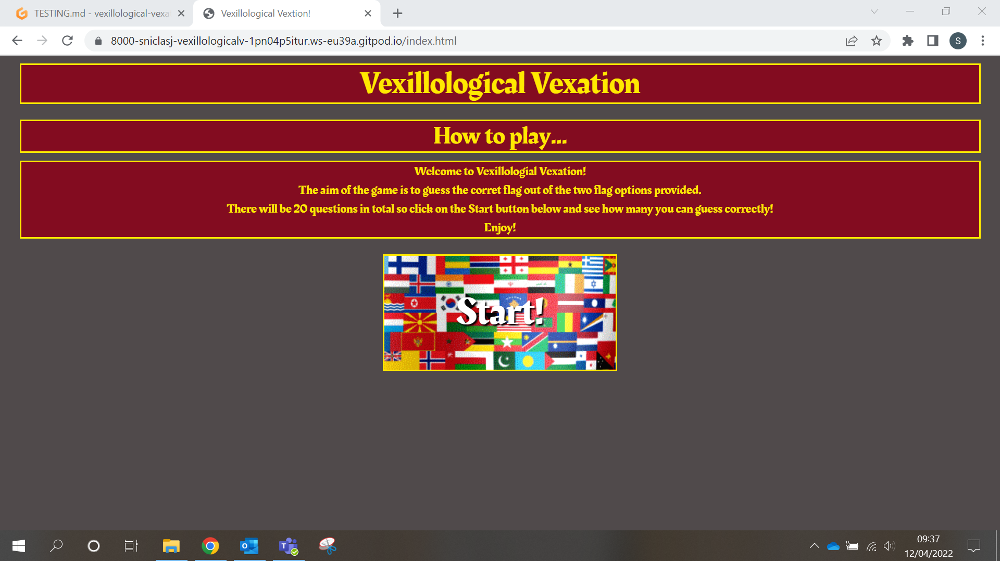

- Chrome Desktop Game Page

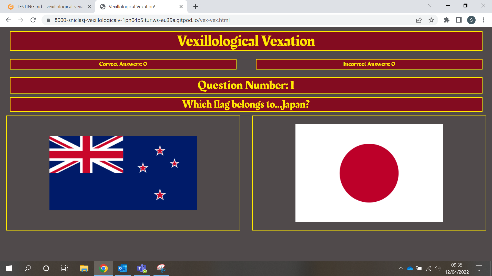

- Chrome Desktop Results Summary Page

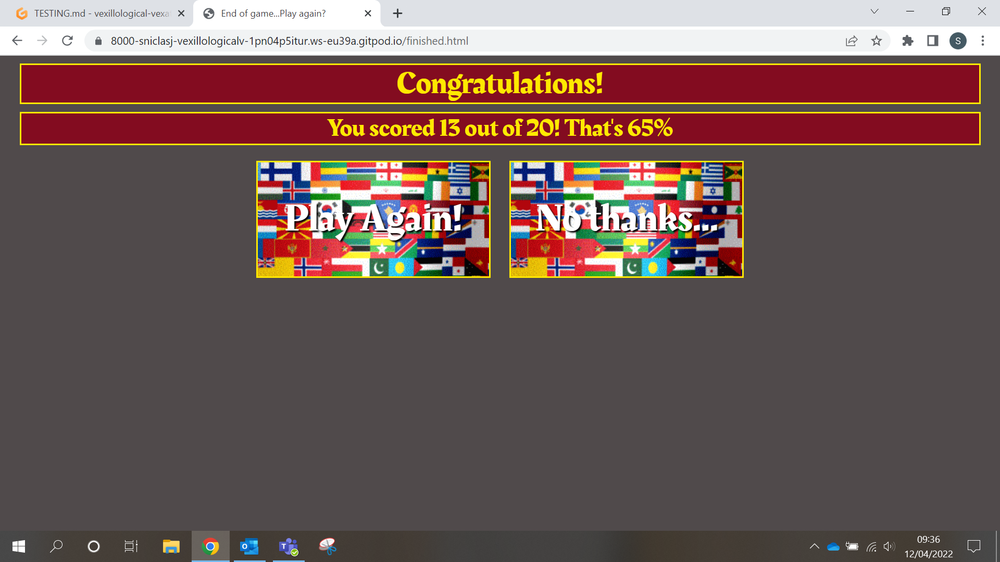

__Edge Screenshots__

- Edge Desktop Landing Page

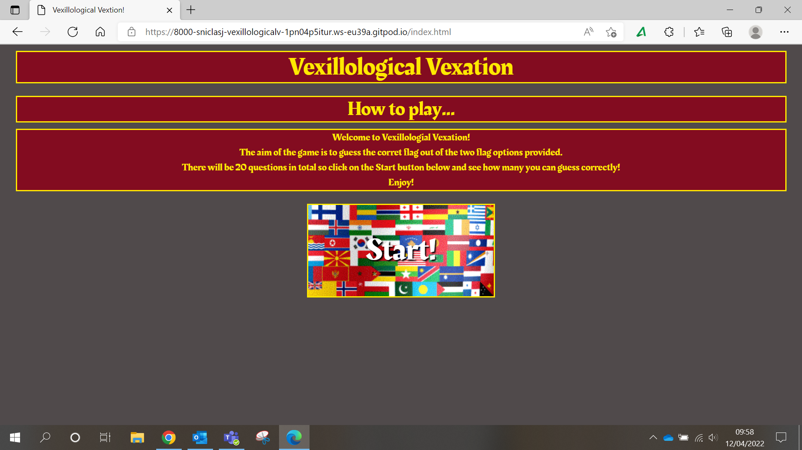

- Edge Desktop Game Page

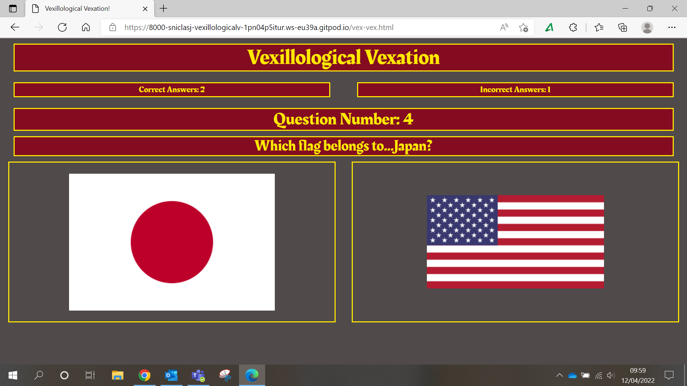

- Edge Desktop Results Summary Page

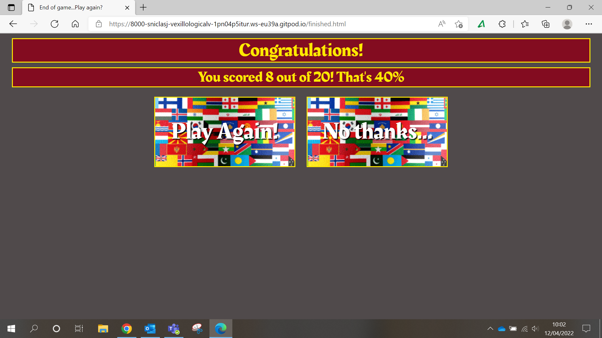

__Safari (Mobile) Screenshots__

- Safari Mobile Landing Page

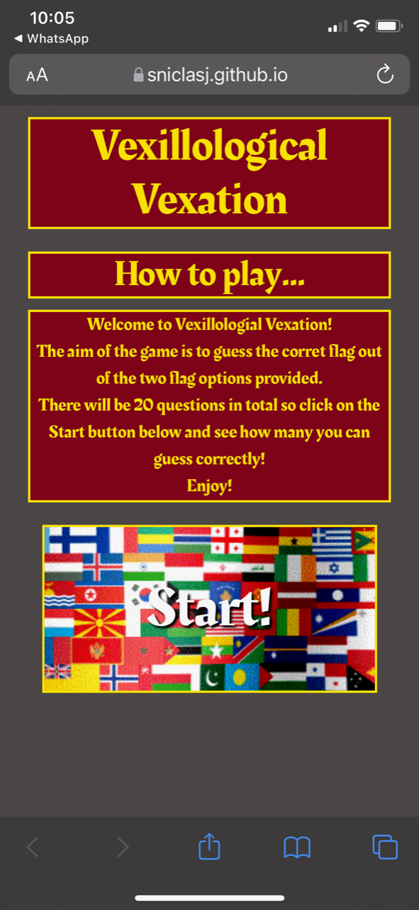

- Safari Mobile Game Page

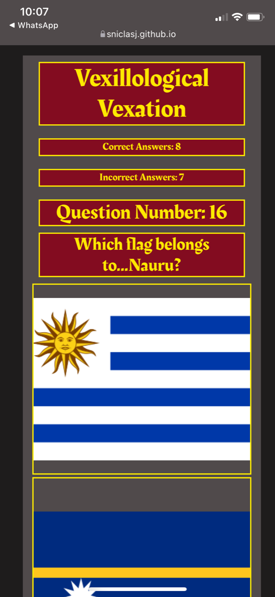

- Safari Mobile Results Summary Page

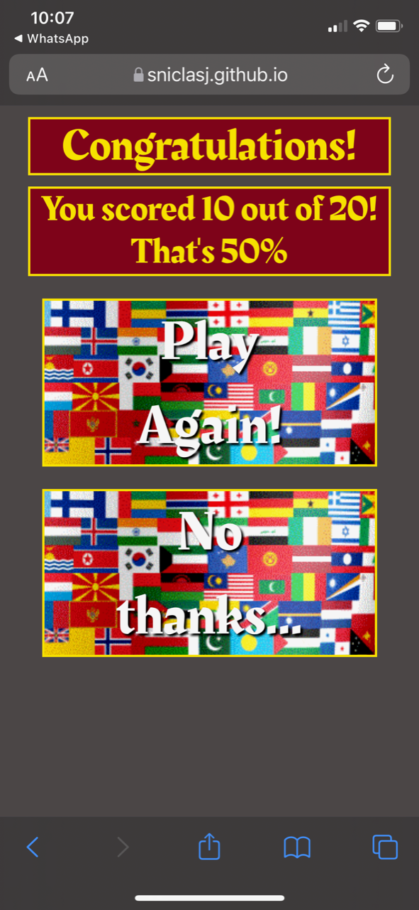

## Code Validation

### HTML

No errors were returned on any page when passing through the official W3C Validator as shown in the links below.
  - [W3C Validator Landing Page](https://validator.w3.org/nu/?doc=https%3A%2F%2Fsniclasj.github.io%2Fvexillological-vexation%2Findex.html)
  - [W3C Validator Game Page](https://validator.w3.org/nu/?doc=https%3A%2F%2Fsniclasj.github.io%2Fvexillological-vexation%2Fvex-vex.html)
  - [W3C Validator Results Summary Page](https://validator.w3.org/nu/?doc=https%3A%2F%2Fsniclasj.github.io%2Fvexillological-vexation%2Ffinished.html)

### CSS

No errors or warnings were found on any page when passing through the official [(Jigsaw) validator](https://jigsaw.w3.org/css-validator/validator?uri=https%3A%2F%2Fsniclasj.github.io%2Fvexillological-vexation%2Findex.html&profile=css3svg&usermedium=all&warning=1&vextwarning=&lang=en#warnings) as shown in the screenshot below.
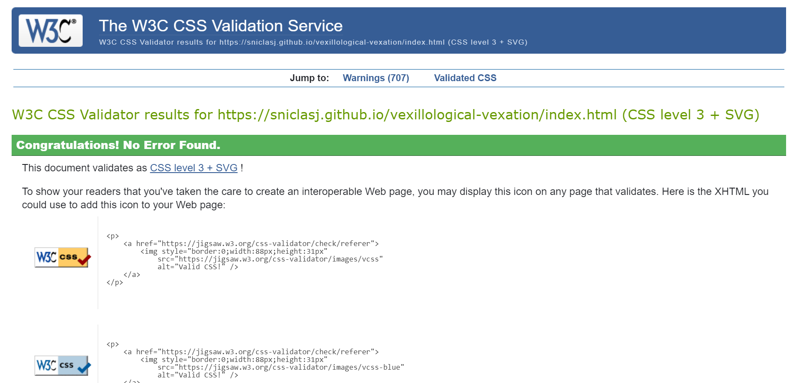

### Lighthouse

__Test Results: Landing Page__

__Test Results: Game Page__

__Test Results: Results Summary__

The issue highlighted in the Lighthouse testing is due to the contrast of text colour in relation to background colour on the pricing.html page. This is discussed in the Unfixed Bugs section at the end of this document.

## Responsiveness

__Landing Page Page__

Large

Medium

Small

__Game Page__

Large

Medium

Small

__Results Summary Page__

Large

Medium

Small

## User Story Tests

- As a user, I want to be able to read about how to play the game before playing.
- As a user, I want to be able to initiate the start of the game myself.
- As a user, I want to be able to intuitively know where to click to make my flag selection.
- As a user, I want to be able to see my performance within the game e.g. how many questions have I got correct/incorrect so far.
- As a user, I want to be able to avoid repetition of flags I have already guessed correctly.
- As a user, I want to be able to view the site on any device, so that I can see it on my phone, tablet, or desktop.

## Unfixed Bugs

- Console error module is not defined.
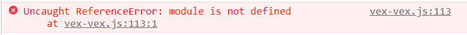

- When 11/20 = 55% is scored, the percentage calculation shows decimal places. This only occurs on this specific score.
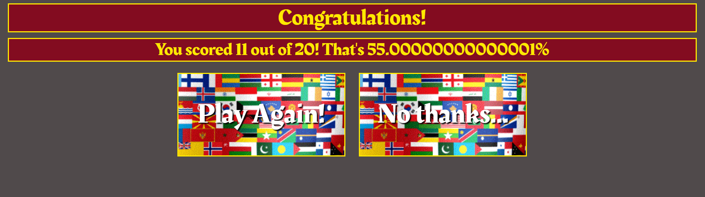