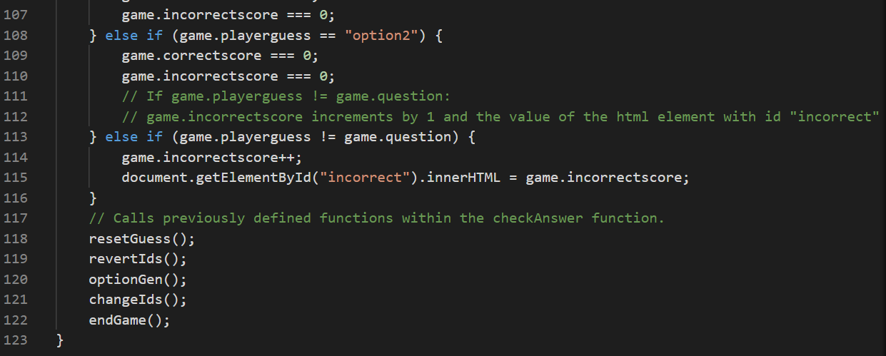

# Testing

## Test Driven Development with JEST

A test driven development approach was taken in order to develop the game. This was done by utilising the JEST testing suite.
Tests were built and validated prior to building core game functionality.

During the course of developing the game, limitations with the JEST test suite were encountered.
This is likely related to the way I have written my code and this will therefore be a consideration for future projects.
In order to evaluate the limitations, an explanation of how the code functions is required. This is detailed in the following section.

### Code Functionality Explanation

- In vex-vex.html, the buttons where the clickable flag images are displayed have respective IDs "option1" and "option2".

- In vex-vex.js, two functions (optionGen and changeIds) run once the DOM content of vex-vex.html has loaded.

- optionGen randomly selects two different flag IDs from game.database.flags and changeIds replaces the IDs of the clickable button elements with the flag IDs generated by optionGen.

- Once the functions optionGen and changeIds have run, the clickable buttons in vex-vex.html will no longer have the IDs "option1" and "option2" but they will have the values of game.option1 and game.option2 respectively. The values of game.option1 and game.option2 will correspond to a three letter country code e.g. 'wal' for Wales. This three letter country code matches a CSS ID e.g. #wal which styles the clickable button with an image of the Welsh flag.

- The next step is for the player to attempt to guess the correct flag by clicking on one of the buttons.
- When this occurs, the checkAnswer function runs. The checkAnswer function's role is to check if the player's guess is correct or incorrect, however, additional functions run as part of the checkAnswer function.
- One of these functions is revertIds which runs before optionGen and changeIds run again within the checkAnswer function.

- revertIds changes the IDs of the clickable buttons from the values of game.option1 and game.option2 back to their original IDs of "option1" and "option2" e.g. the ID of one of the buttons would be updated from "wal" back to "option1".
- This allows changeIds to 'find' the button elements and update their respective IDs to new game.option1 and game.option2 values generated by optionGen for the next question in the game.
- This means that an example flow of the button elements' IDs would be "option1" -> "wal" -> "option1" -> "nzl". This would represent question 1 displaying the Welsh flag and question 2 displaying a New Zealand flag.
- The transition from an ID of "wal" -> "option1" -> "nzl" is seamless and it looks like an instant transition from "wal" to "nzl" however the method of achieving this has caused issues when running the JEST test suite.

### Test Limitations Discussion

Based on the above description of code functionality, I was unable to test if the functions optionGen and changeIDs worked in the desired way solely within the test suite. This is because the test was never able to find HTML elements with the IDs of "option1" or "option2".
The reason for this is that by the time the page had loaded, the below code had executed meaning that the IDs had already changed to values such as 'wal' and 'nzl'.

This meant that the tests always failed despite the game functioning exactly as expected when looking at information in the console.

The next issue I encountered was that the test suite would not run at all unless I commented out the below code.

When attempting to run the code without commenting this code out, the below was returned.

When I commented this code out before running the tests, the following results were achieved.

Unfortunately, this code is essential to the functionality of the game so it cannot be removed from the vex-vex.js file permanently.

Again, I believe the reason for this test suite failure is due to the fact that elements with IDs of "option1" and "option2" only exist transiently in my code which means that the tests cannot 'find' these IDs which leads to test failures.

Despite the afforementioned test issues, the game functions exactly as desired and this is verified by observing the console whilst playing the game.
In future projects, I will keep these learnings in mind and this will help me devlop my code writing skills to ensure that these issues do not arise again.

## Browser Compatibility

The game website has been successfully tested on the following browsers:
- Chrome
- Edge
- Safari (on personal mobile device - iPhone 11 Pro)

__Chrome Screenshots__

- Chrome Desktop Landing Page

- Chrome Desktop Game Page

- Chrome Desktop Results Summary Page

__Edge Screenshots__

- Edge Desktop Landing Page

- Edge Desktop Game Page

- Edge Desktop Results Summary Page

__Safari (Mobile) Screenshots__

- Safari Mobile Landing Page

- Safari Mobile Game Page

- Safari Mobile Results Summary Page

## Code Validation

### HTML

No errors were returned on any page when passing through the official W3C Validator as shown in the links below.
  - [W3C Validator Landing Page](https://validator.w3.org/nu/?doc=https%3A%2F%2Fsniclasj.github.io%2Fvexillological-vexation%2Findex.html)

  

  - [W3C Validator Game Page](https://validator.w3.org/nu/?doc=https%3A%2F%2Fsniclasj.github.io%2Fvexillological-vexation%2Fvex-vex.html)

  

  - [W3C Validator Results Summary Page](https://validator.w3.org/nu/?doc=https%3A%2F%2Fsniclasj.github.io%2Fvexillological-vexation%2Ffinished.html)

  

### Semantic HTML Discussion

I have intentionally decided not to use sections in my HTML files. The reason for this is that when I was utilising sections, the HTML validators referenced above were issuing warning regarding the lack of headings in my sections. Although I am aware that I should be utilising sections as opposed to divs in order to be to semantically correct, the presence of section headings would detract from the desired aesthetic of my game therefore I have opted to maintain the use of divs and explain my reasoning here.

### CSS

No errors or warnings were found on any page when passing through the official [(Jigsaw) validator](https://jigsaw.w3.org/css-validator/validator?uri=https%3A%2F%2Fsniclasj.github.io%2Fvexillological-vexation%2Findex.html&profile=css3svg&usermedium=all&warning=1&vextwarning=&lang=en#warnings) as shown in the screenshot below.

### JavaScript

_JS Hint Results: Landing Page_

_JS Hint Results: Game Page_

_JS Hint Results: Finished Page_

### Lighthouse

__Test Results: Landing Page__

__Test Results: Game Page__

__Test Results: Results Summary__

The only issue highlighted in the Lighthouse testing is the use of the .gif format on the animated content on the Results Summary Page. The report has suggested utilising a video format such as .mp4 instead, however, I could only find the animated content I wanted to use in .gif format.
In future, I will filter my search for animated content to ensure that the .gif format is omitted.

## Responsiveness

__Landing Page__

Large

Medium and Below

__Game Page__

Large

Medium and Below

__Results Summary Page__

Large

Medium and Below

## User Story Tests

- As a user, I want to be able to read about how to play the game before playing.
- As a user, I want to be able to initiate the start of the game myself.

- As a user, I want to be able to intuitively know where to click to make my flag selection.
- As a user, I want to be able to see my performance within the game e.g. how many questions have I got correct/incorrect so far.

- As a user, I want to be able to avoid repetition of flags I have already guessed correctly. Note: The screenshot below shows how correctly guessed flag IDs are removed from the original array of 50 and stored in a separate array called 'used flags'.

- As a user, I want to be able to view the site on any device, so that I can see it on my phone, tablet, or desktop.

## Unfixed Bugs

There are no unfixed bugs that I am aware of within the game.