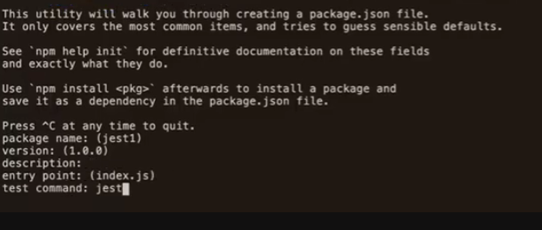

# Testing

## Installing The JEST Testing Suite

In order to build the game using test driven development, the JEST testing suite needs to be installed. The following section will detail how to achieve this.
Note: Some screenshots have been taken from the instructional video on the [Code Institute LMS](https://learn.codeinstitute.net/courses/course-v1:CodeInstitute+JT101+2021_T1/courseware/6175d249ea924b1b8d315ba8e7bb1626/8639190f4a6c437784788b882f357b1d/).

- Create a file and name it using the following convention: NAME_OF_JS_FILE_TO_TEST.test.js.
For example, the js file I wanted to test was vex-vex.js therefore my file was named vex-vex.test.js.


- Type _npm init_ into the console.


- All defaults can be kept except _jest_ must be input as the test command.



- Once the remaining defauls have been selected, the console will display the below and a command line must be input to install JEST.


- The command line to input is _npm install jest --save-dev_ as shown below.


- JEST is now installed and the command line _npm test_ can be used to run tests however, no tests will be found at this stage.
- Now, within the test file (vex-vex.test.js in my case), insert the following code taking note that the fs.readFileSync refers to the js file you wish to test (vex-vex.html in my case):

```javascript
beforeAll(() => {
    let fs = require("fs");
    let fileContents = fs.readFileSync("vex-vex.html", "utf-8");
    document.open();
    document.write(fileContents);
    document.close();
});
```

- The next steps depend on the specific game structure. In my example, I planned to have a 'game' object to hold the game state in my vex-vex.js file which keeps track of certain game keys such as _database_ for example.
- To write a test for this, I wrote a testing block using the describe function as shown below.

```javascript
// Test for existence of game keys
describe("game object contains correct keys", () => {
    test("database key exists", () => {
        expect("database" in game).toBe(true);
    });
    test("option1 key exists", () => {
        expect("option1" in game).toBe(true);
    });
    test("option2 key exists", () => {
        expect("option2" in game).toBe(true);
    });
    test("question key exists", () => {
        expect("question" in game).toBe(true);
    });
    test("playerguess key exists", () => {
        expect("playerguess" in game).toBe(true);
    });
    test("usedflags key exists", () => {
        expect("usedflags" in game).toBe(true);
    });
    test("correctscore key exists", () => {
        expect("correctscore" in game).toBe(true);
    });
    test("incorrectscore key exists", () => {
        expect("incorrectscore" in game).toBe(true);
    });
    test("questionnum key exists", () => {
        expect("questionnum" in game).toBe(true);
    });
});
```

- Initially, all of these tests would fail, however, I would then write the minimum amount of code required to get these tests to pass in my vex-vex.js file.
- The finished product of the vex-vex.js code written to satisfy the tests for the existence of specific game keys is below.

```javascript
// Define keys for the game.
let game = {
    database: {
        flags: ["arg", "aut", "bel", "bol", "bra", "can", "cpv", "chl", "hrv", "cze", "dnk", "etr", "ecu", "egy", "est", "eth", "fra", "deu", "gha", "grl", "hnd", "isl", "irl", "imn", "ita", "civ", "jpn", "ken", "kir", "mdg", "mwi", "mlt", "nru", "nzl", "nga", "nir", "nor", "pan", "wsm", "sco", "sen", "syc", "zaf", "esp", "swe", "ukr", "ury", "usa", "vnm", "wal"],
        countries: ["Argentina", "Austria", "Belgium", "Bolivia", "Brazil", "Canada", "Cape Verde", "Chile", "Croatia", "Czech Republic", "Denmark", "East Timor", "Ecuador", "Egypt", "Estonia", "Ethiopia", "France", "Germany", "Ghana", "Greenland", "Honduras", "Iceland", "Ireland", "Isle of Man", "Italy", "Ivory Coast", "Japan", "Kenya", "Kiribati", "Madagascar", "Malawi", "Malta", "Nauru", "New Zealand", "Nigeria", "Northern Ireland", "Norway", "Panama", "Samoa", "Scotland", "Senegal", "Seychelles", "South Africa", "Spain", "Sweden", "Ukraine", "Uruguay", "USA", "Vietnam", "Wales"],
    },
    option1: [],
    option2: [],
    question: [],
    playerguess: [],
    usedflags: [],
    correctscore: [],
    incorrectscore: [],
    questionnum: [],
};
```

- Finally, there are two more important blocks of code to include to ensure that the test suite functions correctly.
- Firstly, the file being tested must be imported into the testing file therefore constants must be declared in the testing file (vex-vex.test.js) as shown below. Note: Curly braces are used as eventually more objects and functions will be being imported.

```javascript
const {
    game,
} = require("../vex-vex");
```

- Secondly, in the js file (vex-vex.js), the game object being tested in this instance must be exported to our testing file using module exports as shown below. Note: Curly braces are used as eventually more objects and functions will be being exported.

```javascript
if (typeof module !== "undefined") module.exports = {
    game,
};
```

- Now that these steps have been undertaken, further tests can be written and be expected to fail initially. JS code can then be added to get the tests to pass as part of the Red, Green refactor process.

## Test Driven Development with JEST

A test driven development approach was taken in order to develop the game. This was done by utilising the JEST testing suite.
Tests were built and validated prior to building core game functionality.

During the course of developing the game, limitations with the JEST test suite were encountered.
This is likely related to the way I have written my code and this will therefore be a consideration for future projects.
In order to evaluate the limitations, an explanation of how the code functions is required. This is detailed in the following section.

### Code Functionality Explanation

- In vex-vex.html, the buttons where the clickable flag images are displayed have respective IDs "option1" and "option2" as well as the class of "flag".

```html
    <!-- Section for the two clickable buttons displaying respective flag images -->
    <div class="container-fluid">
        <div class="row">
            <div class="col-md-6 text-center">
                <button id="option1" class="flag" aria-label="flag option 1"></button>
            </div>
            <div class="col-md-6 text-center">
                <button id="option2" class="flag" aria-label="flag option 2"></button>
            </div>
        </div>
    </div>
```

- In vex-vex.js, two functions (optionGen and changeIds) run once the DOM content of vex-vex.html has loaded.

```javascript
// Awaits for the content of the page to be loaded before running optionGen and changeIds functions which are integral to displaying the flag options for the player to guess.
document.addEventListener("DOMContentLoaded", function () {
    optionGen();
    changeIds();
});
```

- optionGen randomly selects two different flag IDs from game.database.flags and changeIds replaces the IDs of the clickable button elements with the flag IDs generated by optionGen as well as updating the background image of the flag class to match the flag ID image.

```javascript
// Function to randomly generate values for game.option1 and 
// game.option2 from the game.database.flags array.
function optionGen() {
    game.questionnum++;
    document.getElementById("question-num").innerHTML = `Question Number: ` + (game.questionnum);
    game.option1 = (game.database.flags[Math.floor(Math.random() * game.database.flags.length)]);

    //Filters game.option1 value out of game.database.flags array
    //and selects game.option2 value from filtered array. This
    //ensures that game.option1 != game.option2.
    //Credit: https://www.w3schools.com/jsref/jsref_filter.asp
    //Credit: https://stackoverflow.com/questions/5767325/how-can-i-remove-a-specific-item-from-an-array
    let value = game.option1;
    let arr = game.database.flags;
    let databaseFilt = arr.filter(function (item) {
        return item !== value;
    });
    //Generates game.option2 value from the filtered dabase which does
    //not contain the generated game.option1 value.
    game.option2 = (databaseFilt[Math.floor(Math.random() * databaseFilt.length)]);
    //Generates question value which is either game.option1 or game.option2.
    game.question = [game.option1, game.option2][Math.round(Math.random())];
}

// Replaces html elements with ids option1 and option2 with the randomly generated flag image background ids game.option1 and game.option2.
function changeIds() {
    // Credit: https://www.w3schools.com/jsref/prop_html_id.asp

    let flag1 = document.getElementById("option1");
    let flag2 = document.getElementById("option2");
    flag1.style.background = `url(assets/images/${game.option1}-flag.png) center no-repeat`;
    flag2.style.background = `url(assets/images/${game.option2}-flag.png) center no-repeat`;
    flag1.id = game.option1;
    flag2.id = game.option2;
    // Identifies index of country name linked to random flag id used for game.question and publishes it into the innerHTML text of html element with id "question".
    // Credit: https://www.w3schools.com/jsref/tryit.asp?filename=tryjsref_node_textcontent_innerhtml_innertext
    let indexQ = game.database.flags.indexOf(game.question);
    document.getElementById("question").innerHTML = `Which flag belongs to...` + (game.database.countries[indexQ]) + `?`;
}
```

- Once the functions optionGen and changeIds have run, the clickable buttons in vex-vex.html will no longer have the IDs "option1" and "option2" but they will have the values of game.option1 and game.option2 respectively. The values of game.option1 and game.option2 will correspond to a three letter country code e.g. 'wal' for Wales. This three letter country code matches the image for that respective flag in the images folder e.g. wal-flag which applies a background of the Welsh flag to the button.


- The next step is for the player to attempt to guess the correct flag by clicking on one of the buttons.
- When this occurs, the checkAnswer function runs. The checkAnswer function's role is to check if the player's guess is correct or incorrect, however, additional functions run as part of the checkAnswer function.
- One of these functions is revertIds which runs before optionGen and changeIds run again within the checkAnswer function.

```javascript
// Changes the flag image background ids of html elements with ids game.option1 and game.option2 back to option1 and option2 respectively.
function revertIds() {
    let opt1 = document.getElementById(game.option1);
    let opt2 = document.getElementById(game.option2);
    opt1.style.background = `url(assets/images/all-flags.gif) center no-repeat`;
    opt2.style.background = `url(assets/images/all-flags.gif) center no-repeat`;
    opt1.id = "option1";
    opt2.id = "option2";
}
```

```javascript
function checkAnswer() {
    // Defines indexQ as the value of the index of flag id pushed into game.question.
    let indexQ = game.database.flags.indexOf(game.question);
    // If game.playerguess id == game.question id:
    if (game.playerguess == game.question) {
        // id of game.question is pushed into game.usedflags array.
        game.usedflags.push(game.question);
        // Flag id and country id are spliced from the overall game.database so that they cannot appear in the game again.
        // Splice code credit: https://love2dev.com/blog/javascript-remove-from-array/#remove-from-array-splice
        game.database.flags.splice(indexQ, 1);
        game.database.countries.splice(indexQ, 1);
        // game.correctscore increments by 1 and the value of the html element with id "correct" is updated to the new value.
        game.correctscore++;
        document.getElementById("correct").innerHTML = game.correctscore;
        // If game.playerguess == the id "option1"or "option2", this ensures the score remains as zero.
        // This is to prevent accidental score incrementation in the short period of time where placeholder images are in place instead of flag images.
        // The ids of the placeholder images are "option1" and "option2" respectively so if these are clicked, the code below ensures the scores do not accidentally increment.
    } else if (game.playerguess == "option1") {
        game.correctscore = 0;
        game.incorrectscore = 0;
    } else if (game.playerguess == "option2") {
        game.correctscore = 0;
        game.incorrectscore = 0;
        // If game.playerguess != game.question:
        // game.incorrectscore increments by 1 and the value of the html element with id "incorrect" is updated to the new value.
    } else if (game.playerguess != game.question) {
        game.incorrectscore++;
        document.getElementById("incorrect").innerHTML = game.incorrectscore;
    }
    // Calls previously defined functions within the checkAnswer function.
    resetGuess();
    revertIds();
    optionGen();
    changeIds();
    endGame();
}
```

- revertIds changes the IDs of the clickable buttons from the values of game.option1 and game.option2 back to their original IDs of "option1" and "option2" e.g. the ID of one of the buttons would be updated from "wal" back to "option1".
- This allows changeIds to 'find' the button elements and update their respective IDs to new game.option1 and game.option2 values generated by optionGen for the next question in the game.
- This means that an example flow of the button elements' IDs would be "option1" -> "wal" -> "option1" -> "nzl". This would represent question 1 displaying the Welsh flag and question 2 displaying a New Zealand flag.
- The transition from an ID of "wal" -> "option1" -> "nzl" is seamless and it looks like an instant transition from "wal" to "nzl" however the method of achieving this has caused issues when running the JEST test suite.

### Test Limitations Discussion

Based on the above description of code functionality, I was unable to test if the functions optionGen and changeIDs worked in the desired way solely within the test suite. This is because the test was never able to find HTML elements with the IDs of "option1" or "option2".
The reason for this is that by the time the page had loaded, the below code had executed meaning that the IDs had already changed to values such as 'wal' and 'nzl'.

```javascript
// Awaits for the content of the page to be loaded before running optionGen and changeIds functions which are integral to displaying the flag options for the player to guess.
document.addEventListener("DOMContentLoaded", function () {
    optionGen();
    changeIds();
});
```

This meant that the tests always failed despite the game functioning exactly as expected when looking at information in the console.

The next issue I encountered was that the test suite would not run at all unless I commented out the below code.


When attempting to run the code without commenting this code out, the below was returned.


When I commented this code out before running the tests, the following results and coverage reports were achieved.


Note: To obtain a coverage report, the following must be enterted into the console: _npm test -- --coverage_.

Unfortunately, this code is essential to the functionality of the game so it cannot be removed from the vex-vex.js file permanently.

Again, I believe the reason for this test suite failure is due to the fact that elements with IDs of "option1" and "option2" only exist transiently in my code which means that the tests cannot 'find' these IDs which leads to test failures.

Despite the afforementioned test issues, the game functions exactly as desired and this is verified by observing the console whilst playing the game.
In future projects, I will keep these learnings in mind and this will help me devlop my code writing skills to ensure that these issues do not arise again.

## Browser Compatibility

The game website has been successfully tested on the following browsers:
- Chrome
- Edge
- Safari (on personal mobile device - iPhone 11 Pro)

__Chrome Screenshots__

- Chrome Desktop Landing Page


- Chrome Desktop Game Page


- Chrome Desktop Results Summary Page


__Edge Screenshots__

- Edge Desktop Landing Page


- Edge Desktop Game Page


- Edge Desktop Results Summary Page


__Safari (Mobile) Screenshots__

- Safari Mobile Landing Page


- Safari Mobile Game Page


- Safari Mobile Results Summary Page


## Code Validation

### HTML

No errors were returned on any page when passing through the official W3C Validator as shown in the links below.
  - [W3C Validator Landing Page](https://validator.w3.org/nu/?doc=https%3A%2F%2Fsniclasj.github.io%2Fvexillological-vexation%2Findex.html)

  

  - [W3C Validator Game Page](https://validator.w3.org/nu/?doc=https%3A%2F%2Fsniclasj.github.io%2Fvexillological-vexation%2Fvex-vex.html)

  

  - [W3C Validator Results Summary Page](https://validator.w3.org/nu/?doc=https%3A%2F%2Fsniclasj.github.io%2Fvexillological-vexation%2Ffinished.html)

  

### Semantic HTML Discussion

I have intentionally decided not to use sections in my HTML files. The reason for this is that when I was utilising sections, the HTML validators referenced above were issuing warning regarding the lack of headings in my sections. Although I am aware that I should be utilising sections as opposed to divs in order to be to semantically correct, the presence of section headings would detract from the desired aesthetic of my game therefore I have opted to maintain the use of divs and explain my reasoning here.

### CSS

No errors or warnings were found on any page when passing through the official [(Jigsaw) validator](https://jigsaw.w3.org/css-validator/validator?uri=https%3A%2F%2Fsniclasj.github.io%2Fvexillological-vexation%2Findex.html&profile=css3svg&usermedium=all&warning=1&vextwarning=&lang=en#warnings) as shown in the screenshot below.


### JavaScript

_JS Hint Results: Landing Page_


_JS Hint Results: Game Page_


The _undefined variable_ of _module_ shown in the JS Hint screenshot is required to export the objects and functions to the Jest testing file. The following code prevents this causing an error in the console. This JS Hint 'warning' can be ignored in this context.

```javascript
if (typeof module !== "undefined") module.exports = {
    game,
    optionGen,
    changeIds,
    revertIds,
    playerGuess,
    resetGuess,
    checkAnswer,
    endGame,
};
```


_JS Hint Results: Finished Page_


### Lighthouse

__Test Results: Landing Page__


__Test Results: Game Page__


__Test Results: Results Summary__


The only issue highlighted in the Lighthouse testing is the use of the .gif format on the animated content on the Results Summary Page. The report has suggested utilising a video format such as .mp4 instead, however, I could only find the animated content I wanted to use in .gif format.
In future, I will filter my search for animated content to ensure that the .gif format is omitted.

## Responsiveness

__Landing Page__

Large


Medium and Below


__Game Page__

Large


Medium and Below


__Results Summary Page__

Large


Medium and Below


## User Story Tests

- As a user, I want to be able to read about how to play the game before playing.
- As a user, I want to be able to initiate the start of the game myself.


- As a user, I want to be able to intuitively know where to click to make my flag selection.
- As a user, I want to be able to see my performance within the game e.g. how many questions have I got correct/incorrect so far.


- As a user, I want to be able to avoid repetition of flags I have already guessed correctly. Note: The screenshot below shows how correctly guessed flag IDs are removed from the original array of 50 and stored in a separate array called 'used flags'.


- As a user, I want to be able to view the site on any device, so that I can see it on my phone, tablet, or desktop.


- As a user, I want to be able to restart the game if I have made too many mistakes.


- As a user, I want to be able to navigate back to the landing page in-game.


- As a user, I want to be able to learn more about the person who developed the game.


## Unfixed Bugs

The unfixed bugs I have been unable to resolve are discussed below.

### Reset Button Misalignment on Mobile Safari Browser

The 'Reset!' button text is slightly off-centre on the Safari Mobile Browser screen. This does not occur when testing responsiveness for devices with screen sizes of medium and below in browsers such as Chrome and Edge.
I attempted to resolve this by adding an explicit padding of zero to the button's style as outlined [here](https://stackoverflow.com/questions/44941161/safari-on-ios-cant-render-button-text-center-aligned) on Stack Overflow, however this did not resolve my issue.


### Workaround To Prevent Back Button Usage

This isn't strictly a bug but I would like ot highlight it regardless.

Prior to implementing the below code, use of the browser's back button on finished.html would break the game as it was possible for the user to navigate back to vex-vex.html and continue selecting flags beyoned the limit of 20. When I noticed this, I implemented the below code in the head section of vex-vex.html to stop this occurring.

This has solved the problem and prevents the game from breaking, however I am highlighting it in this section as it is a 'workaround' and I am certain that given more time, I would be able to devise a more robust solution.

```html
    <!-- Prevents users navigating 'back' from finished.html to vex-vex.html -->
    <!-- Code Credit: https://stackoverflow.com/questions/19926641/how-to-disable-the-back-button-in-the-browser-using-javascript -->
    <script>
        function preventBack() {
            window.history.forward();
        }
    
        setTimeout("preventBack()", 0);
        window.onunload = function() {
            null
        };
    </script>
```